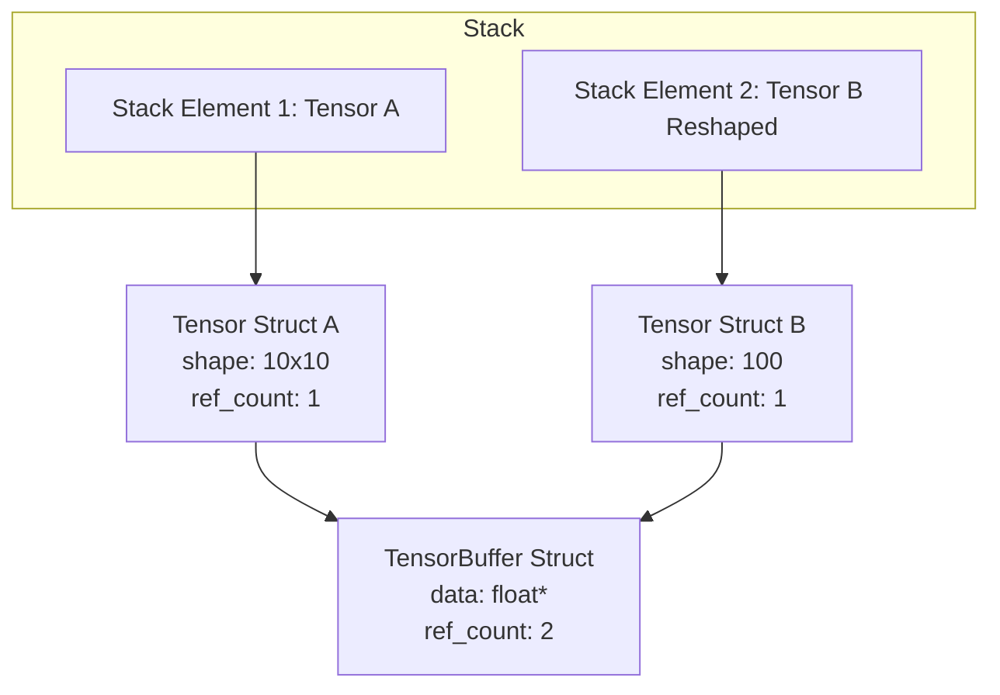

### Logica del programma:

#### Leggere e interpretare token:
Aprire il file sorgente, caricare il testo in memoria e scorrerlo identificando i singoli token separated da spazi o ritorni a capo.
- Se il token definisce un elemento letterale (un tensore 1D tipo `[ 1 2 3 ]` o una stringa tipo `"immagine.pgm"`), lo inseriamo sullo stack.
- Se il token identifica un operatore (es. `+`, `d`, `c`, ecc.), estraiamo gli elementi necessari dallo stack, eseguiamo l'operazione e reinseriamo l'eventuale risultato.

Esempio:
```forth
[ 1 2 3 ] [ 4 5 6 ] +
```
1. `[` -> Inizio lettura vettore $\rightarrow$ Inserito `[ 1 2 3 ]` sullo stack.
2. `[` -> Inizio lettura vettore $\rightarrow$ Inserito `[ 4 5 6 ]` sullo stack.
3. `+` -> Operatore di somma $\rightarrow$ Pop dei due vettori, calcolo della somma, push del risultato `[ 5 7 9 ]`.

---

### Comandi da implementare (Suddivisi per Categoria):

Tutte le operazioni element-wise richiedono che i tensori in input abbiano la **stessa identica dimensione**. In caso di errore di compatibilità o mancanza di operandi sullo stack, l'interprete deve segnalare l'errore ed uscire con codice di errore diverso da 0.

#### 1. Operazioni Aritmetiche Element-Wise
* `+` (somma) $\rightarrow$ Input: 2 tensori. Output: 1 tensore.
* `-` (sottrazione) $\rightarrow$ Input: 2 tensori. Output: 1 tensore.
* `*` (prodotto) $\rightarrow$ Input: 2 tensori. Output: 1 tensore.

#### 2. Operazioni di Comparazione Element-Wise
Restituiscono un tensore contenente `1.0` dove la condizione è vera, e `0.0` dove è falsa.
* `<` (minore di) $\rightarrow$ Input: 2 tensori. Output: 1 tensore di 0.0 e 1.0.
* `>` (maggiore di) $\rightarrow$ Input: 2 tensori. Output: 1 tensore di 0.0 e 1.0.
* `=` (uguale a) $\rightarrow$ Input: 2 tensori. Output: 1 tensore di 0.0 e 1.0.

#### 3. Operazioni Logiche Element-Wise
Lavorano su tensori che contengono unicamente `0.0` (falso) e `1.0` (vero).
* `&` (AND logico) $\rightarrow$ Input: 2 tensori. Output: 1 tensore.
* `|` (OR logico) $\rightarrow$ Input: 2 tensori. Output: 1 tensore.
* `!` (NOT logico) $\rightarrow$ **Input: 1 tensore** (Operatore unario!). Output: 1 tensore.

#### 4. Selezione
* `$` (selezione condizionale) $\rightarrow$ `b a m $`.
  - Input: 3 tensori (i due tensori di dati $b$ e $a$, e la maschera $m$ contenente solo 0.0 e 1.0).
  - Output: 1 tensore. Per ogni elemento, se $m_i == 1.0$ prende l'elemento da $a_i$, altrimenti da $b_i$.

#### 5. Operazioni Specifiche per Tensori
* `@` (moltiplicazione matriciale) $\rightarrow$ Input: 2 tensori 2D compatibili (colonne di $a$ = righe di $b$). Output: 1 tensore 2D (righe di $a$ $\times$ colonne di $b$). *(Parallelizzabile con OpenMP)*.
* `.` (prodotto interno / dot product) $\rightarrow$ Input: 2 tensori 1D di uguale dimensione. Output: 1 tensore 1D con un singolo elemento.
* `c` (convoluzione 2D) $\rightarrow$ `a k c`. Input: 2 tensori 2D ($a$ immagine, $k$ kernel). Output: 1 tensore 2D di dimensione uguale ad $a$ (con zero-padding e stride 1). *(Parallelizzabile con OpenMP)*.

#### 6. Operazioni di Forma e Dimensione
* `r` (reshape) $\rightarrow$ `a s r`. Input: Tensore $a$ e un tensore 1D $s$ (le nuove dimensioni). Modifica le dimensioni di $a$ in $s$ senza copiare i dati in memoria.
* `_` (ravel) $\rightarrow$ Input: 1 tensore. Appiattisce il tensore in un vettore 1D senza copiare i dati.
* `#` (shape) $\rightarrow$ Input: 1 tensore. Output: Un vettore 1D contenente la forma (es. `[ 100 50 ]`).

#### 7. Generazione, Riduzione e Riempimento
* `?` (generazione casuale) $\rightarrow$ `s ?`. Input: 1 tensore 1D $s$ (dimensioni). Output: Un tensore di forma $s$ contenente float casuali in $[0, 1]$. *(Non parallelizzabile con OpenMP per via di `rand()`)*.
* `R` (ReLU) $\rightarrow$ Input: 1 tensore. Output: 1 tensore con applicato $\max(0, x)$.
* `m` (minimo) $\rightarrow$ Input: 2 tensori. Output: 1 tensore con il minimo valore elemento per elemento.
* `M` (massimo) $\rightarrow$ Input: 2 tensori. Output: 1 tensore con il massimo valore elemento per elemento.
* `S` (somma di riduzione) $\rightarrow$ Input: 1 tensore. Output: 1 tensore 1D di un singolo elemento contenente la somma di tutti gli elementi.
* `f` (fill) $\rightarrow$ `s v f`. Input: 1 tensore 1D $s$ (dimensioni) e un tensore 1D $v$ (valori). Output: Un tensore di forma $s$ riempito con i valori di $v$ ripetuti.

#### 8. Operazioni di I/O (Consigliato raggrupparle in una sottoclasse)
* `(` (leggi PGM) $\rightarrow$ `"file.pgm" (`. Input: 1 stringa. Output: Tensore 2D con pixel normalizzati in $[0.0, 1.0]$.
* `)` (scrivi PGM) $\rightarrow$ `a "file.pgm" )`. Input: 1 tensore 2D e 1 stringa. Rimappa $[0, 1]$ in $[0, 255]$ e scrive su file.
* `{` (mmap leggi tensore) $\rightarrow$ `"file.bin" {`. Input: 1 stringa. Output: Tensore caricato in memoria tramite `mmap` (senza copiare dati).
* `}` (scrivi tensore) $\rightarrow$ `a "file.bin" }`. Input: 1 tensore e 1 stringa. Scrive su disco il tensore in formato binario allineato a 64 byte.

---

### Struttura del Progetto:
* `Makefile`: Gestisce compilazione con flag OpenMP, ottimizzazione (`-O3 -march=native`) e target `clean`.
* `TensorForth.c`: Punto di ingresso, lettura argomenti riga di comando, caricamento file sorgente, tokenizzazione e ciclo principale.
* `tensor.h` e `tensor.c`: Struttura del Tensore, allocazione (allineamento 64 byte), reference counting, operazioni matematiche e I/O.
* `stack.h` e `stack.c`: Struttura dello Stack, tipi di elementi supportati (Tensori o Stringhe), funzioni push/pop e operatori stack-level.
* `TEST/run_tests.sh`: Script di automazione per testare sia tutti gli esempi sia file singoli.

---

### Stack:

Lo stack deve supportare elementi eterogenei: **Tensori** e **Stringhe**. In C, si implementa tramite una struct taggata:
```c
typedef enum {
    TYPE_TENSOR,
    TYPE_STRING
} StackElementType;

typedef struct {
    StackElementType type;
    union {
        Tensor* tensor;
        char* string; // Stringa allocata dinamicamente
    } value;
} StackElement;
```

#### Operazioni dello Stack (Stack-level):
* `d` (dup) $\rightarrow$ Duplica l'elemento in cima. **Nota importante**: Per i tensori, NON copia i dati in memoria. Semplicemente copia il puntatore `Tensor*` e incrementa il suo `ref_count`.
* `s` (swap) $\rightarrow$ Scambia i due elementi in cima allo stack. Non altera i ref count.
* `o` (over) $\rightarrow$ Duplica il secondo elemento dello stack e lo inserisce in cima. Incrementa il `ref_count` del tensore.
* `D` (drop) $\rightarrow$ Rimuove l'elemento in cima allo stack. Se è un tensore, decrementa il suo `ref_count` ed eventualmente lo dealloca se raggiunge 0.

---

### Tensore (Separazione Logica vs Fisica):

Sì, la separazione tra rappresentazione logica e fisica ha perfettamente senso ed è l'unico modo corretto per implementare il comportamento condiviso richiesto da `reshape` (`r`) e `ravel` (`_`).

Ad esempio, se abbiamo il tensore logico $A$ (dimensione $10 \times 10$) e facciamo il reshape in $B$ (dimensione $100$), entrambi devono puntare alla **stessa** area di memoria fisica. Se liberiamo $A$, i dati in memoria fisica devono rimanere intatti finché anche $B$ non viene liberato.

Implementiamo questo concetto con due struct:

1. **`TensorBuffer` (Fisico)**: Gestisce il blocco contiguo di float allocato a 64 byte (tramite `posix_memalign` o `mmap`) e tiene traccia del proprio contatore di riferimenti (`ref_count`).
2. **`Tensor` (Logico)**: Gestisce i metadati (forma `shape`, dimensioni `ndim`), punta a un `TensorBuffer` e tiene traccia del proprio `ref_count` logico per dup/over dello stack.



---

### Token:

* **Ha senso fare una codifica di tutte le operazioni come enumerazioni?**
  **Sì, assolutamente.** Nel parser in `TensorForth.c`, dopo aver letto un token di testo (es. "+"), è molto più efficiente convertirlo subito in un valore `enum` (es. `OP_ADD`) e usare uno `switch(op)` all'interno del ciclo di esecuzione. Questo rende il codice estremamente più leggibile, previene errori di battitura sparsi in giro per il codice e aumenta la velocità di esecuzione evitando controlli continui di stringhe (`strcmp`) a runtime.
